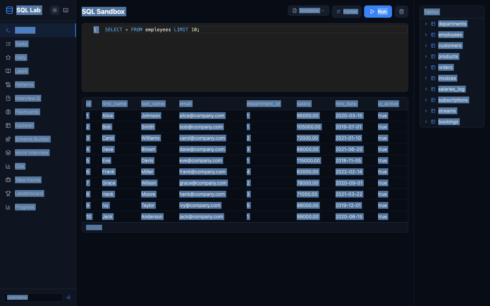
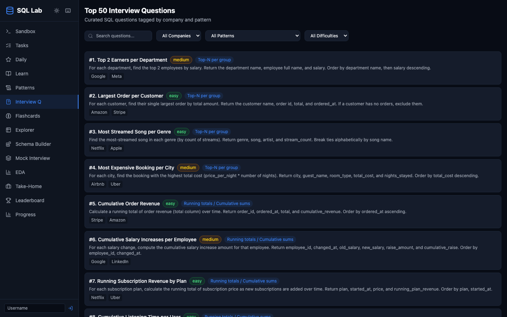
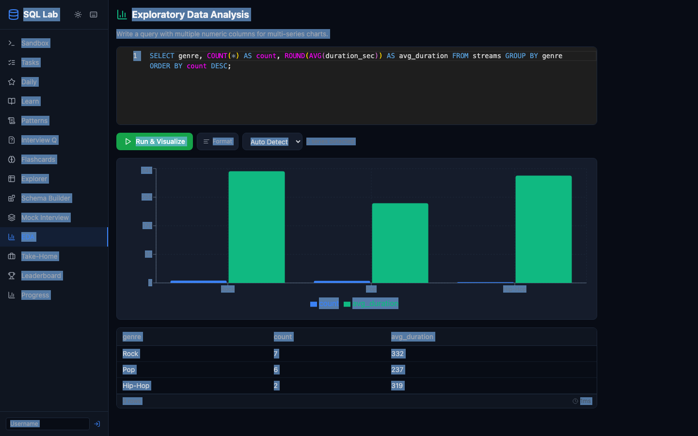
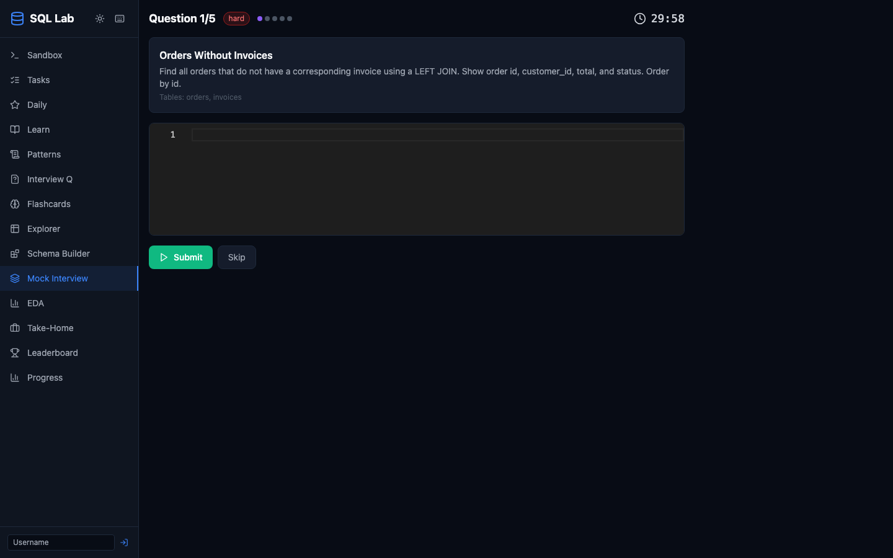
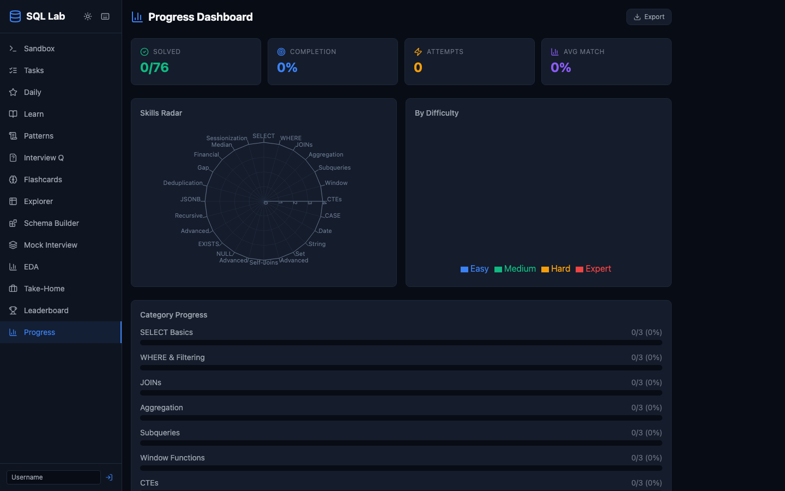

# SQL Trainer

An interactive SQL learning platform for interview preparation. Practice queries against a real PostgreSQL database, learn through structured courses, and prepare for interviews at top tech companies.



## Features

| Feature | Description |
|---------|-------------|
| **SQL Sandbox** | Free-form SQL playground with Monaco editor, 15 query templates, and 18 practice tables |
| **76 Practice Tasks** | Across 24 categories (SELECT, JOINs, Window Functions, CTEs, JSONB, Recursive, ...) and 4 difficulty levels |
| **62 Interview Questions** | From 14 companies (Google, Amazon, Meta, Stripe, Netflix, Uber, ...) covering 17 SQL patterns |
| **10 Learning Paths** | Structured courses from SQL basics to advanced topics (JSONB, recursive CTEs, time-series, financial SQL) |
| **25 SQL Patterns** | Template library with copy-paste patterns and runnable examples |
| **60 Flashcards** | Spaced repetition (SM-2 algorithm) for memorizing SQL concepts |
| **8 Take-Home Projects** | Multi-step real-world assignments inspired by Spotify, Airbnb, Uber, Stripe, etc. |
| **Schema Builder** | Visual database design tool with drag-and-drop tables, FK arrows, live DDL generation, and validation |
| **Mock Interview** | Timed 30-minute simulation with 5 random tasks and scoring |
| **EDA Charts** | Auto-visualize query results as bar, line, pie, or scatter charts |
| **Progress Tracking** | Dashboard with radar charts, per-category breakdowns, and exportable data |
| **Leaderboard** | Compete with other users by tasks solved |
| **Daily Challenges** | New task every day with streak tracking |

## Quick Start

```bash
git clone <repo-url>
cd SQL-Traine
cp backend/.env.example backend/.env
docker compose up
```

Open **http://localhost:5173** in your browser.

That's it. Docker Compose starts PostgreSQL, the FastAPI backend, and the Vite frontend automatically. The database is seeded with 18 tables of practice data on first run.

## Screenshots

<table>
<tr>
<td><br/><b>76 Practice Tasks</b></td>
<td><br/><b>62 Interview Questions</b></td>
</tr>
<tr>
<td><br/><b>10 Learning Paths</b></td>
<td><br/><b>Visual Schema Builder</b></td>
</tr>
<tr>
<td><br/><b>25 SQL Patterns</b></td>
<td><br/><b>EDA Visualization</b></td>
</tr>
<tr>
<td><br/><b>Mock Interview</b></td>
<td><br/><b>Progress Dashboard</b></td>
</tr>
</table>

## Tech Stack

| Layer | Technology |
|-------|-----------|
| **Frontend** | React 18, TypeScript, Vite, Tailwind CSS, Monaco Editor, Recharts |
| **Backend** | FastAPI, Python 3.12, asyncpg, Pydantic |
| **Database** | PostgreSQL 16 |
| **Infrastructure** | Docker Compose |

## Architecture

```
┌─────────────────────────────────────────────────────────────┐
│  Browser (localhost:5173)                                    │
│  React + TypeScript + Monaco Editor + Tailwind              │
│                                                             │
│  14 Pages: Sandbox, Tasks, Learn, Interview, Patterns,      │
│  Flashcards, Explorer, SchemaBuilder, Mock, EDA, TakeHome,  │
│  Daily, Progress, Leaderboard                               │
└──────────────────────┬──────────────────────────────────────┘
                       │ /api (Vite proxy)
┌──────────────────────▼──────────────────────────────────────┐
│  FastAPI Backend (localhost:8000)                            │
│                                                             │
│  15 Routers: auth, execute, tasks, progress, mock, daily,   │
│  history, bookmarks, streaks, leaderboard, flashcards,      │
│  interview, patterns, schema_builder, assignment_progress   │
│                                                             │
│  Services: Sandbox (schema isolation), Auth (JWT),          │
│  Diff (result comparison)                                   │
│                                                             │
│  Data: 76 tasks, 62 interview Qs, 10 learning paths,       │
│  25 patterns, 60 flashcards, 8 assignments (Python)         │
└──────────────────────┬──────────────────────────────────────┘
                       │
┌──────────────────────▼──────────────────────────────────────┐
│  PostgreSQL 16                                              │
│                                                             │
│  18 practice tables (employees, orders, subscriptions, ...)  │
│  + app tables (users, progress, history, bookmarks, ...)     │
│                                                             │
│  Sandbox: per-session schema isolation for safe query exec   │
└─────────────────────────────────────────────────────────────┘
```

## Development

### Prerequisites

- Docker and Docker Compose

### Running

```bash
docker compose up          # Start all services
docker compose down        # Stop everything
```

### Development without Docker

**Backend:**
```bash
cd backend
pip install -r requirements.txt
# Set DATABASE_URL and JWT_SECRET in backend/.env
uvicorn main:app --host 0.0.0.0 --port 8000 --reload
```

**Frontend:**
```bash
cd frontend
npm install
npm run dev
```

### Verifying Changes

```bash
# TypeScript check
cd frontend && npx tsc --noEmit

# Production build
cd frontend && npx vite build

# API health check
curl http://localhost:8000/api/health
```

### Code Changes

- **Backend Python changes**: `docker compose restart backend`
- **Frontend changes**: Auto-reload via Vite HMR (no restart needed)
- **Database schema changes**: Recreate the volume: `docker compose down -v && docker compose up`

## Database

18 practice tables with realistic seed data:

| Table | Rows | Description |
|-------|------|-------------|
| `employees` | 12 | Employee records with departments and salaries |
| `departments` | 5 | Department information |
| `customers` | 8 | Customer data |
| `products` | 10 | Product catalog |
| `orders` | 15 | Order transactions |
| `invoices` | 10 | Invoice records |
| `salaries_log` | 12 | Salary change history |
| `subscriptions` | 8 | Subscription plans |
| `streams` | 30 | Music/video streaming data |
| `bookings` | 20 | Booking records |
| `ab_tests` | 10 | A/B test experiments |
| `clickstream` | 20 | User click events |
| `categories` | 8 | Hierarchical category tree |
| `transactions` | 25 | Financial transactions |
| `user_profiles` | 5 | Profiles with JSONB settings |
| `tickets` | 10 | Support tickets |
| `sensor_readings` | 49 | IoT sensor data with anomalies |
| `event_log` | 53 | App events with sessions |

## API Endpoints

All endpoints are prefixed with `/api`.

| Method | Endpoint | Auth | Description |
|--------|----------|------|-------------|
| POST | `/auth/register` | - | Register user |
| POST | `/auth/login` | - | Login |
| POST | `/execute` | opt | Execute SQL |
| GET | `/tasks` | - | List tasks (76) |
| GET | `/tasks/meta` | - | Task categories/difficulties |
| GET | `/tasks/{id}` | - | Task detail with solution |
| POST | `/tasks/{id}/check` | opt | Check solution |
| GET | `/progress` | req | User task progress |
| POST | `/progress` | req | Save task progress |
| GET | `/interview-questions` | - | List questions (62) |
| GET | `/interview-questions/meta` | - | Company/pattern stats |
| GET | `/interview-questions/{id}` | - | Question detail |
| POST | `/interview-questions/{id}/check` | opt | Check solution |
| GET | `/interview-questions/progress` | req | Interview progress |
| POST | `/interview-questions/progress` | req | Save interview progress |
| GET | `/learning-paths` | - | List paths (10) |
| GET | `/patterns` | - | List patterns (25) |
| GET | `/patterns/categories` | - | Pattern categories (12) |
| GET | `/flashcards` | - | List flashcards (60) |
| GET | `/flashcards/progress` | req | Flashcard SRS state |
| POST | `/flashcards/review` | req | Submit flashcard review |
| GET | `/assignments` | - | List assignments (8) |
| GET | `/assignments/progress` | req | Assignment step progress |
| POST | `/assignments/progress` | req | Save step completion |
| GET | `/tables` | - | List DB tables (18) |
| GET | `/tables/{name}` | - | Table data (paginated) |
| GET | `/tables/{name}/schema` | - | Column info |
| POST | `/mock/start` | opt | Start mock interview |
| POST | `/mock/end` | opt | End mock, get results |
| GET | `/daily` | - | Today's challenge |
| GET | `/history` | req | Query history |
| DELETE | `/history` | req | Clear history |
| GET/POST/DELETE | `/bookmarks` | req | Manage bookmarks |
| GET/POST | `/streaks` | req | Streak tracking |
| GET | `/leaderboard` | - | Rankings |
| POST | `/format` | - | Format SQL |
| GET | `/templates` | - | Query templates (15) |
| POST | `/schema-builder/validate` | - | Validate DDL |
| GET | `/health` | - | Health check |

## Content Summary

| Content Type | Count | Details |
|-------------|-------|---------|
| Practice Tasks | 76 | 24 categories, 4 difficulty levels |
| Interview Questions | 62 | 14 companies, 17 SQL patterns |
| Learning Paths | 10 | SQL fundamentals to advanced JSONB/recursive/financial |
| SQL Patterns | 25 | 12 categories with templates |
| Flashcards | 60 | SM-2 spaced repetition |
| Take-Home Assignments | 8 | 4-5 steps each, company-inspired |
| Query Templates | 15 | Pre-built sandbox queries |
| Practice Tables | 18 | Realistic seed data |

## Documentation

See [docs/USER_GUIDE.md](docs/USER_GUIDE.md) for the full user guide with screenshots of every feature.

## License

MIT
