# SQL Trainer — User Guide

An interactive SQL learning platform for interview preparation. Practice queries, learn theory, track progress, and prepare for real-world SQL interviews.

---

## Table of Contents

1. [Getting Started](#getting-started)
2. [Sandbox — Free SQL Playground](#sandbox)
3. [Tasks — Guided Practice](#tasks)
4. [Daily Challenge — Build Streaks](#daily-challenge)
5. [Learning Paths — Structured Curriculum](#learning-paths)
6. [Patterns — SQL Cheat Sheet](#patterns)
7. [Interview Questions — Top 50 Company Questions](#interview-questions)
8. [Flashcards — Spaced Repetition](#flashcards)
9. [Table Explorer — Browse the Database](#table-explorer)
10. [Schema Builder — Visual Database Design](#schema-builder)
11. [Mock Interview — Timed Simulation](#mock-interview)
12. [EDA — Data Visualization](#eda)
13. [Take-Home Projects — Real-World Assignments](#take-home-projects)
14. [Progress Dashboard — Track Your Learning](#progress-dashboard)
15. [Leaderboard — Compete with Others](#leaderboard)
16. [Settings & Preferences](#settings)

---

## Getting Started

### Launching the Platform

Start all services with Docker Compose:

```bash
docker compose up
```

Open your browser and navigate to **http://localhost:5173**.

### Navigation

The sidebar on the left contains links to all 14 sections of the platform. On mobile, tap the hamburger menu to open the sidebar.

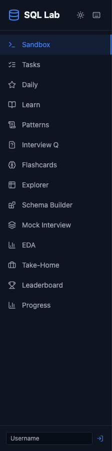

### Account & Login

At the bottom of the sidebar, enter a username and click the login icon to create an account. Logging in enables:
- Bookmark saving
- Flashcard progress tracking
- Leaderboard participation
- Query history persistence

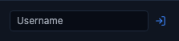

### Theme Toggle

Click the sun/moon icon at the top of the sidebar to switch between dark and light themes. Your preference is saved automatically.


### Keyboard Shortcuts

| Shortcut | Action |
|----------|--------|
| `Ctrl/Cmd + Enter` | Run SQL query |
| `Ctrl/Cmd + Shift + F` | Format SQL |
| `Esc` | Close modal / Go back |

Click the keyboard icon in the sidebar header to view all shortcuts.

---

## Sandbox

**Route:** `/` (Home page)

The Sandbox is a free-form SQL playground where you can write and execute any query against the practice database.

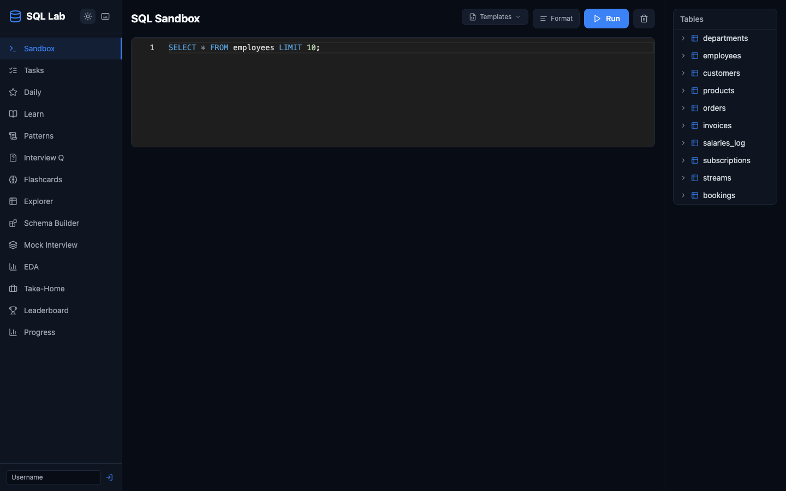

### Features

- **Monaco SQL Editor** with syntax highlighting and autocomplete
- **Run** button (or `Ctrl+Enter`) to execute queries
- **Format** button (or `Ctrl+Shift+F`) to auto-format SQL
- **Query Templates** dropdown — select from pre-built queries to get started
- **Table Sidebar** — click any table name to see its schema

### Writing and Running Queries

1. Type your SQL query in the editor
2. Press `Ctrl+Enter` or click **Run**
3. Results appear in a paginated table below
4. Execution time and row count are displayed


### Query Templates

Click the templates dropdown to load pre-built queries for common operations (JOINs, aggregations, window functions, etc.).

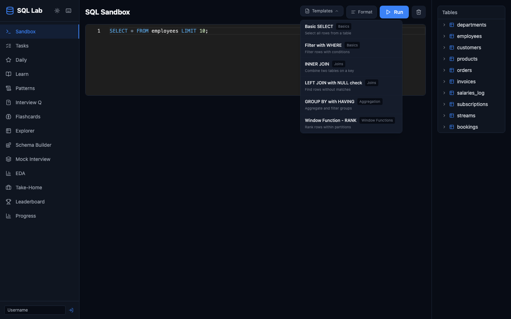

---

## Tasks

**Route:** `/tasks`

35+ practice tasks organized by category and difficulty. Each task has a description, expected output, optional hints, and a full solution.


### Filtering Tasks

Use the dropdown filters at the top to narrow tasks by:
- **Category**: SELECT, JOINs, Aggregations, Subqueries, Window Functions, and 20+ more
- **Difficulty**: Easy, Medium, Hard, Expert

### Solving a Task

1. Click a task card to open it
2. Read the description and note the related tables
3. Write your SQL solution in the editor
4. Click **Check Solution**

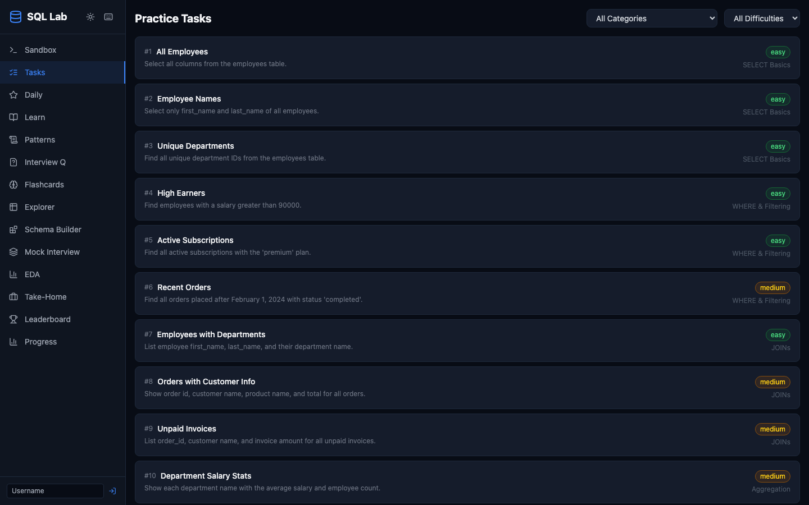

### Getting Help

- **Show Hint** — reveals a hint to guide you (yellow section)
- **Show Solution** — reveals the expected SQL query
- **Explanation** — detailed walkthrough of the solution approach

### Understanding Feedback

After checking your solution, you'll see:
- **Match percentage** — how closely your output matches the expected result
- **Missing rows** (red) — rows in the expected output that your query didn't return
- **Extra rows** (yellow) — rows your query returned that aren't expected
- **Matching rows** (green) — correctly returned rows
- **Column/row order warnings** when applicable


### Bookmarking

Click the bookmark icon on any task to save it for later (requires login).

---

## Daily Challenge

**Route:** `/daily`

A new task every day to build consistent practice habits. Complete daily challenges to build streaks.

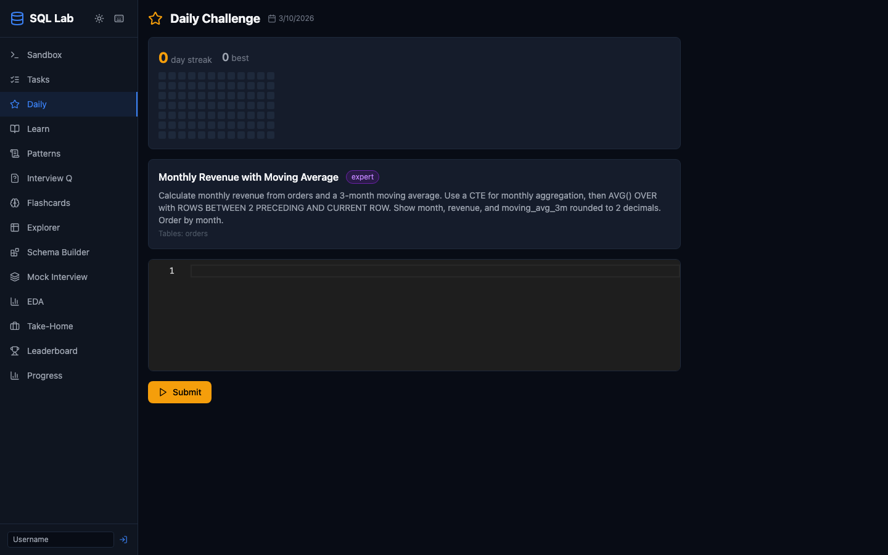

### Streak Tracking

- **Current Streak** — consecutive days you've completed a challenge
- **Best Streak** — your longest streak ever
- **Calendar** — visual display of completed days

### How It Works

1. Open the Daily Challenge page
2. Read and solve today's task
3. Click **Submit** to check your answer
4. Your streak updates automatically on correct answers

---

## Learning Paths

**Route:** `/learn`

6 structured learning paths that take you from basics to advanced SQL:

1. **SELECT Basics** — Filtering, sorting, LIMIT
2. **JOINs** — INNER, LEFT, RIGHT, FULL, CROSS
3. **Aggregations** — GROUP BY, HAVING, aggregate functions
4. **Subqueries** — Correlated, EXISTS, IN
5. **Window Functions** — ROW_NUMBER, RANK, LAG/LEAD
6. **Advanced** — CTEs, CASE, COALESCE, string functions


### Path Structure

Each path contains multiple steps. Each step includes:
- **Theory** — concept explanation
- **Key Points** — bullet-point summary
- **Syntax** — SQL syntax reference
- **Examples** — annotated SQL queries with explanations
- **Knowledge Check** — quiz questions with hidden answers
- **Practice Tasks** — links to related tasks (shows solved status)
- **Interview Tips** — advice for using this concept in interviews

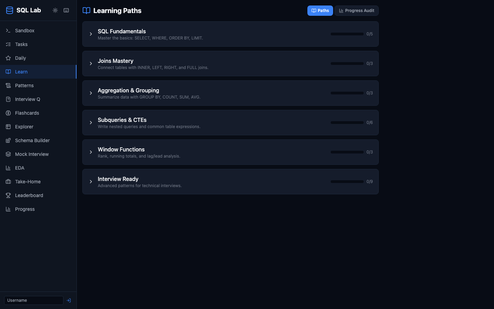

### Progress Audit

Switch to the **Progress Audit** tab to see a detailed breakdown of completion across all paths and steps, with visual progress bars.

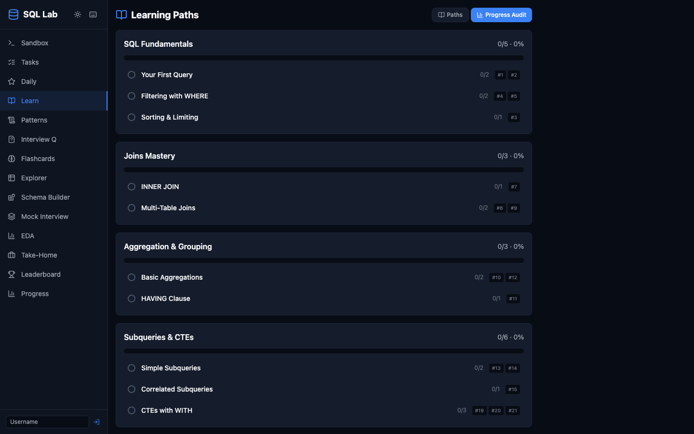

---

## Patterns

**Route:** `/patterns`

A cheat sheet of 20+ common SQL patterns with templates, examples, and explanations.


### Using Patterns

1. Filter by category (Aggregation, Joins, Window Functions, etc.)
2. Expand a pattern card to see details
3. **Copy Template** — copies the SQL template to your clipboard
4. **Run in Sandbox** — opens the Sandbox with the example query pre-filled
5. **Related Tasks** — jump to practice tasks that use this pattern

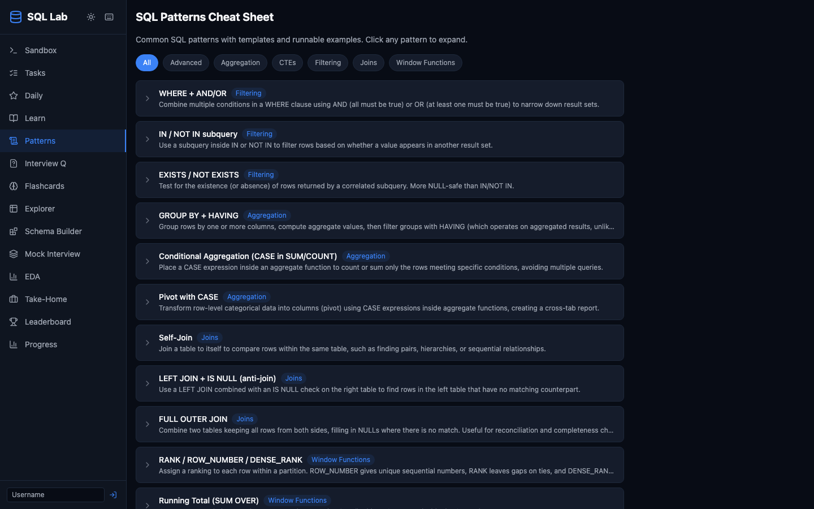

---

## Interview Questions

**Route:** `/interview`

Top 50 SQL interview questions from real companies (Google, Amazon, Meta, Spotify, etc.).


### Filtering & Searching

- **Search** — filter by title or description keyword
- **Company** — filter by company (Google, Amazon, Meta, etc.)
- **Pattern** — filter by SQL pattern type
- **Difficulty** — Easy, Medium, Hard, Expert
- Click any **company tag** on a question card to filter by that company

### Solving Interview Questions

1. Click a question card to open the detail view
2. Read the description and check the related tables
3. Use **Show Schema** to inspect table structure
4. Write your solution and click **Check Solution**
5. Navigate between questions with **Prev/Next** arrows

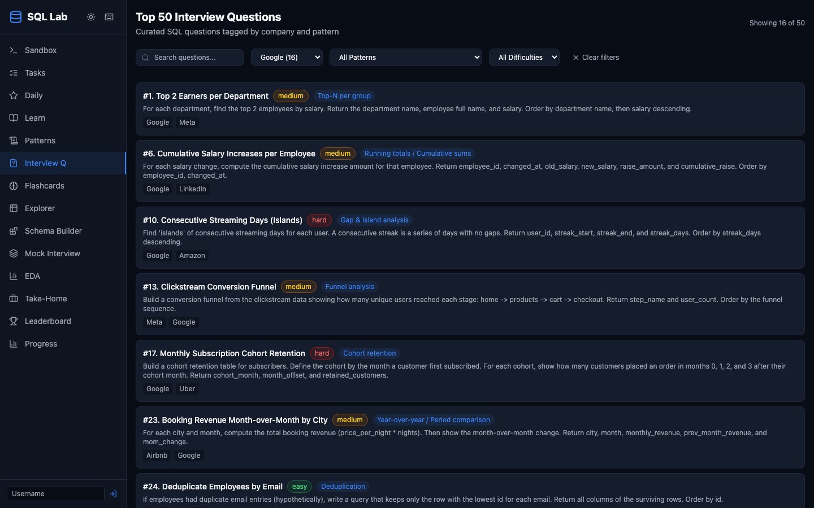

### Additional Helpers

- **Show Hint** — guided hint
- **Show Solution** — the expected SQL
- **View Pattern** — link to the related SQL pattern
- **Show Explanation** — detailed walkthrough

---

## Flashcards

**Route:** `/flashcards`

100+ flashcards with spaced repetition (SM-2 algorithm) to memorize SQL concepts, syntax, and best practices.

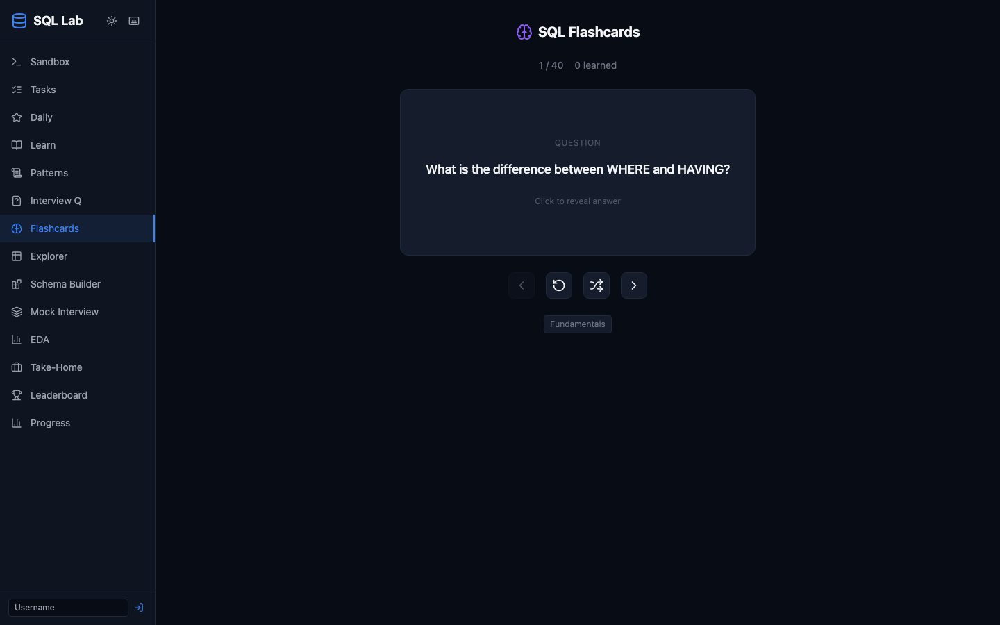

### How It Works

1. Read the question on the front of the card
2. Click the card (or think of your answer)
3. The card flips to reveal the answer
4. Rate your recall:
   - **Again** — couldn't remember (shows again soon)
   - **Hard** — partial recall (shorter interval)
   - **Good** — remembered with effort (normal interval)
   - **Easy** — effortless recall (longer interval)

### Spaced Repetition

The SM-2 algorithm adjusts review intervals based on your ratings:
- Cards you struggle with appear more frequently
- Cards you know well appear less often
- Your **ease factor** and **interval** are shown below each card
- Progress is saved when logged in

### Navigation

- **Prev/Next** — move between cards
- **Shuffle** — randomize card order
- **Reset** — go back to the first card
- **Learned counter** — tracks cards reviewed 2+ times

---

## Table Explorer

**Route:** `/explorer`

Browse all 11+ database tables, view their schemas, and paginate through data.

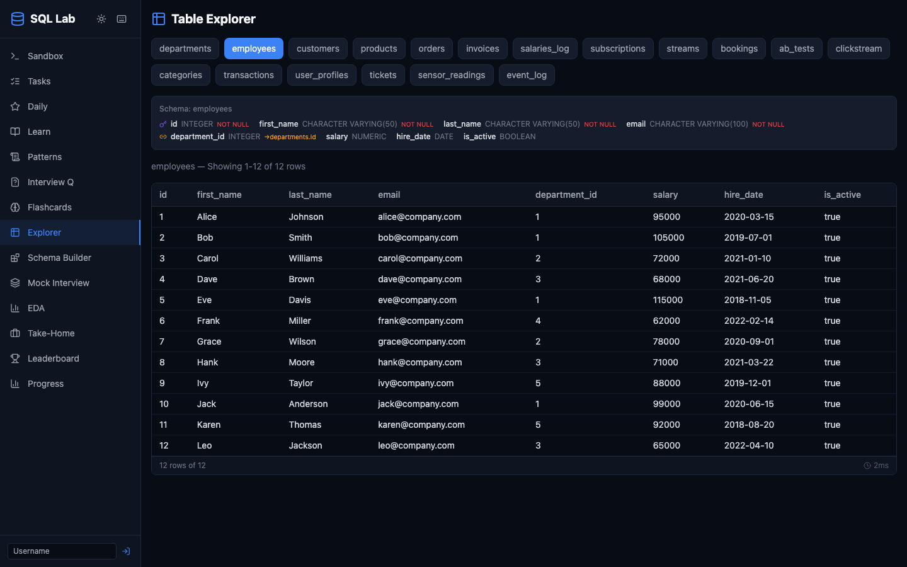

### Features

- **Table selector** — buttons for each available table
- **Schema display** — columns with data types, NOT NULL constraints, and FK relationships
- **Data browser** — paginated view (50 rows per page)
- **Page navigation** — Previous/Next with row range indicator

### Schema Information

For each column you can see:
- Column name
- Data type (VARCHAR, INTEGER, SERIAL, etc.)
- **NOT NULL** constraint (red badge)
- **Foreign Key** reference (yellow badge showing target table.column)

---

## Schema Builder

**Route:** `/schema-builder`

A visual database design tool for creating table schemas, defining relationships, and generating valid PostgreSQL DDL.


### Layout

The Schema Builder has three panels:

| Panel | Content |
|-------|---------|
| **Left Sidebar** | Add Table button, table list, reference guide, export/import |
| **Center Canvas** | Draggable table cards with columns and FK arrows |
| **Right Panel** | Live DDL preview (read-only Monaco editor), Copy & Validate buttons |

### Creating Tables

1. Click **+ Add Table** in the sidebar
2. A new table card appears on the canvas
3. Double-click the table header to rename it
4. Drag the header to reposition the table


### Adding Columns

1. Click **+ Add Column** at the bottom of a table card
2. The Column Editor modal opens
3. Configure the column:
   - **Name** — column identifier
   - **Data Type** — 17 PostgreSQL types (SERIAL, INTEGER, VARCHAR, TEXT, BOOLEAN, DATE, TIMESTAMP, NUMERIC, UUID, JSONB, etc.)
   - **Length** — for VARCHAR(n)
   - **Precision/Scale** — for NUMERIC(p,s)
   - **Constraints** — toggle PRIMARY KEY, NOT NULL, UNIQUE
   - **Default Value** — raw SQL expression (e.g., `NOW()`, `0`, `'active'`)
   - **CHECK Constraint** — validation expression (e.g., `age > 0`)
   - **Foreign Key** — select target table and column
4. Click **Save**

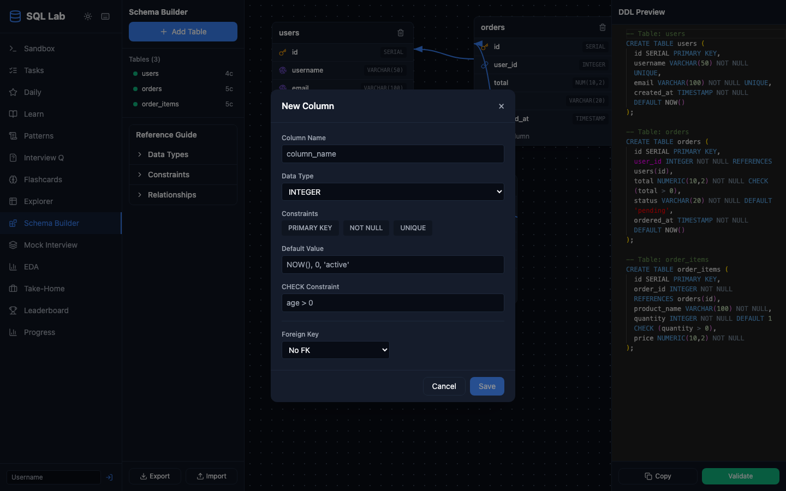

### Defining Foreign Keys

1. Open a column editor (click any column or add a new one)
2. In the **Foreign Key** section, select the target table
3. Select the target column (typically a PRIMARY KEY)
4. Save the column
5. An arrow appears on the canvas connecting the two tables

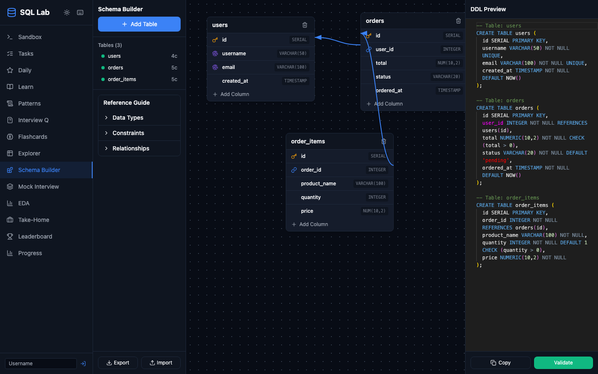

### DDL Preview

The right panel shows the auto-generated `CREATE TABLE` statements in real time. The DDL:
- Updates instantly when you modify the schema
- Uses **topological sort** to ensure referenced tables appear first
- Includes all constraints inline (PK, NOT NULL, UNIQUE, DEFAULT, CHECK, REFERENCES)

### Validating DDL

Click **Validate** to send the DDL to the backend, which executes it in a temporary PostgreSQL schema:
- **Green checkmark** — DDL is valid, shows the number of tables created
- **Red X** — DDL has errors, shows the PostgreSQL error message

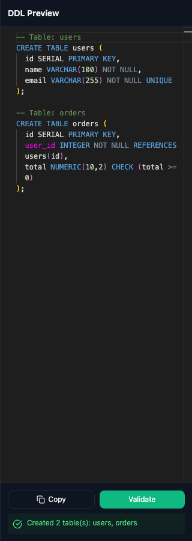

### Export & Import

- **Export** — download your schema as a JSON file
- **Import** — load a previously exported schema from a JSON file
- Your schema is also **auto-saved to localStorage** and persists across page refreshes

### Reference Guide

The sidebar includes a collapsible reference guide with three sections:
- **Data Types** — descriptions and examples for all supported types
- **Constraints** — PK, FK, NOT NULL, UNIQUE, CHECK, DEFAULT syntax
- **Relationships** — 1:1, 1:N, N:M explained with use cases

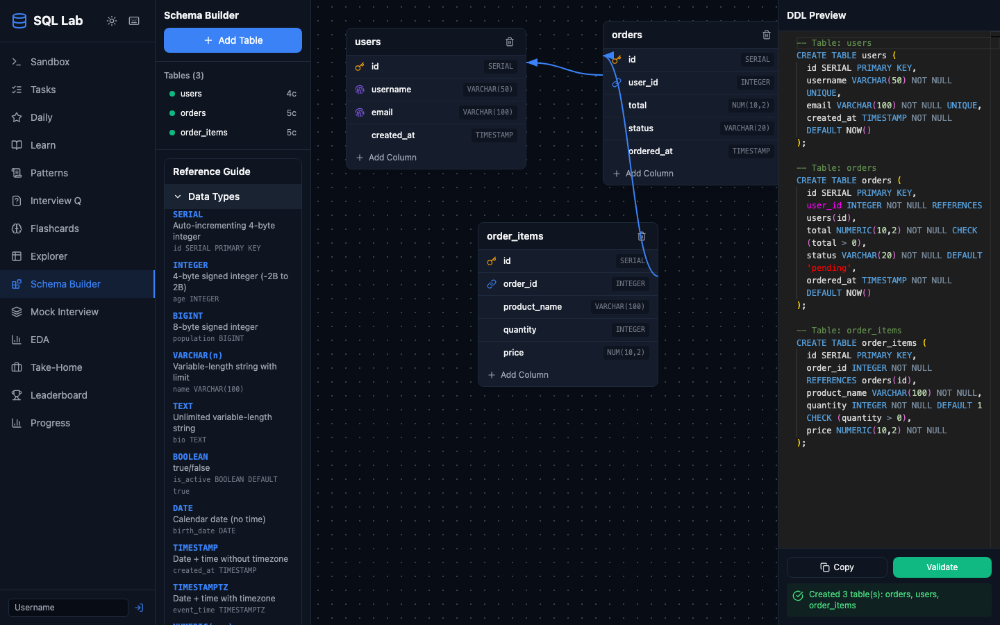

---

## Mock Interview

**Route:** `/mock`

A timed interview simulation: 5 random tasks in 30 minutes, mimicking a real SQL coding interview.

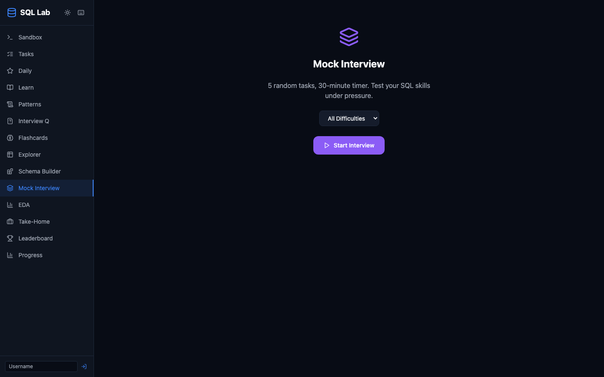

### How It Works

1. Select a difficulty (or "All" for mixed)
2. Click **Start Interview**
3. Solve 5 random tasks within 30 minutes
4. For each task:
   - Read the description
   - Write and submit your SQL
   - Or **Skip** to move to the next question
5. View your final score and per-task breakdown

### During the Interview

- **Timer** — countdown in the top corner
- **Progress dots** — green (correct), red (incorrect), purple (current), gray (remaining)
- **Task counter** — "Question 3/5"


### Results

After completing all questions (or when time expires):
- **Overall score** (color-coded: green >= 80%, yellow >= 50%, red < 50%)
- **Tasks solved count**
- **Time used**
- **Per-task breakdown** — title, difficulty, score, status

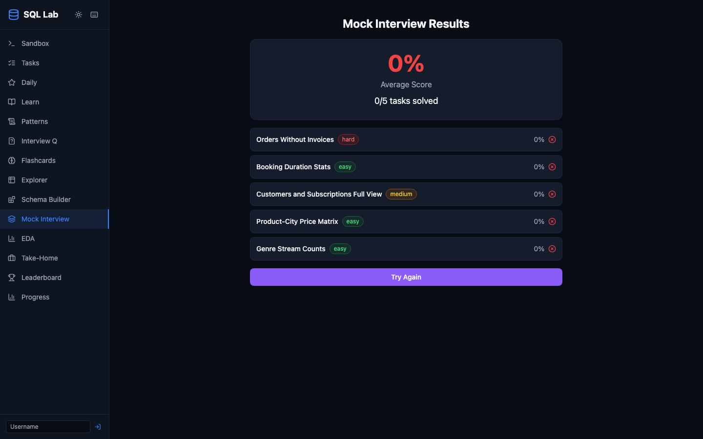

---

## EDA

**Route:** `/eda`

Exploratory Data Analysis — write SQL queries and automatically visualize the results as charts.

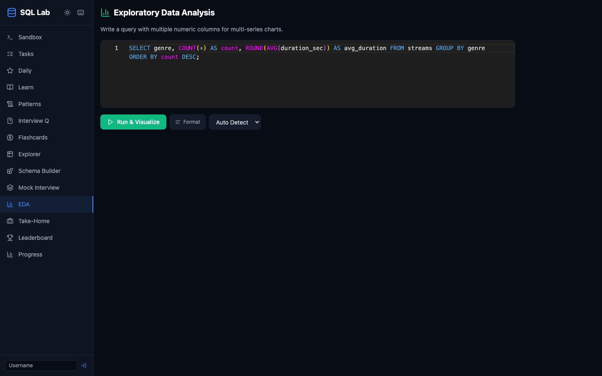

### Chart Types

The platform auto-detects the best chart type, or you can override manually:

| Chart | When Auto-Selected |
|-------|-------------------|
| **Bar** | Default for most queries |
| **Line** | Queries with >10 rows |
| **Pie** | <= 6 rows, single numeric column |
| **Scatter** | 2+ numeric columns, no string columns |

### How to Use

1. Write an aggregation query (e.g., `SELECT department, COUNT(*) FROM employees GROUP BY department`)
2. Click **Run & Visualize**
3. View the auto-generated chart
4. Switch chart type using the dropdown if needed
5. Scroll down to see the raw data table


---

## Take-Home Projects

**Route:** `/take-home`

Multi-step real-world SQL assignments inspired by companies like Google, Amazon, and Meta.

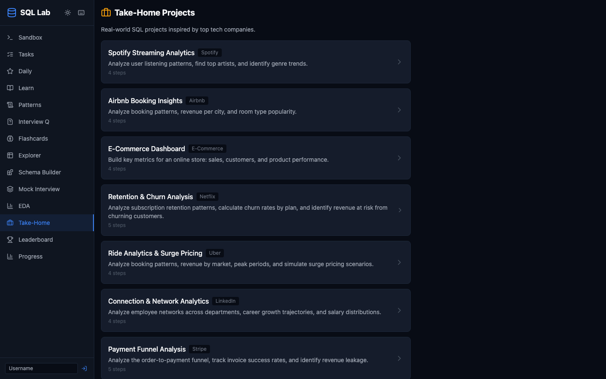

### Working on a Project

1. Select a project from the list
2. Complete steps sequentially — each step builds on the previous one
3. For each step:
   - Read the description and hint
   - Write your SQL
   - Click **Run & Check** to verify
4. Completed steps show a green checkmark in the tab bar

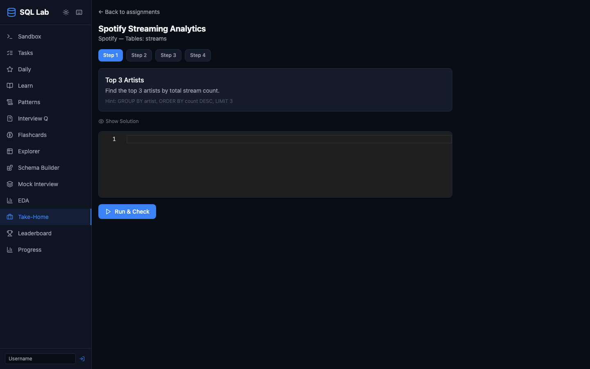

---

## Progress Dashboard

**Route:** `/progress`

A personal analytics dashboard showing your learning progress across all tasks and categories.


### Metrics Displayed

| Metric | Description |
|--------|-------------|
| **Solved** | Tasks completed (X/36) |
| **Completion** | Overall percentage |
| **Attempts** | Total attempts across all tasks |
| **Avg Match** | Average match percentage |

### Visualizations

- **Skills Radar Chart** — your proficiency across SQL categories (SELECT, JOINs, etc.)
- **Difficulty Pie Chart** — breakdown of tasks solved by difficulty level
- **Category Bars** — detailed per-category progress bars

### Export

Click **Export** to download your progress data as a JSON file with timestamp.

---

## Leaderboard

**Route:** `/leaderboard`

See how you rank against other users on the platform.

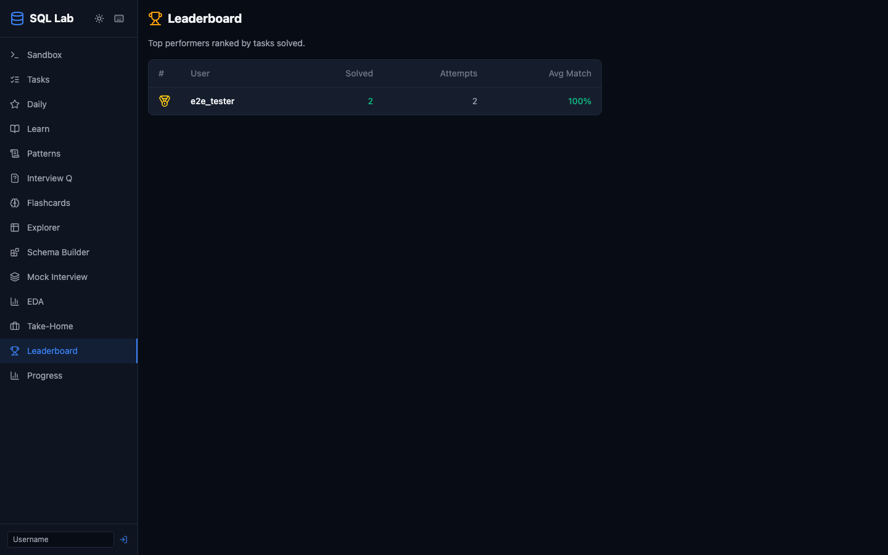

### Ranking Criteria

Users are ranked by **tasks solved** (descending). The table shows:

| Column | Description |
|--------|-------------|
| **Rank** | Position (gold/silver/bronze medals for top 3) |
| **Username** | User identifier |
| **Tasks Solved** | Total completed tasks |
| **Attempts** | Total submission attempts |
| **Avg Match %** | Average match percentage (color-coded) |

---

## Settings

### Dark/Light Theme

Toggle via the sun/moon icon in the sidebar header. Both themes are fully supported across all pages and components.

### Keyboard Shortcuts

Click the keyboard icon in the sidebar to view all available shortcuts.

### Data Persistence

| Data | Storage |
|------|---------|
| Theme preference | localStorage |
| Schema Builder designs | localStorage |
| Interview progress | localStorage |
| Auth token | localStorage |
| Flashcard progress | Server (requires login) |
| Bookmarks | Server (requires login) |
| Query history | Server (requires login) |
| Streaks | Server (requires login) |

---

## Database Schema

The practice database contains 11+ tables for realistic SQL exercises:

| Table | Description |
|-------|-------------|
| `employees` | Employee records with departments |
| `departments` | Department information |
| `customers` | Customer data |
| `products` | Product catalog |
| `orders` | Order transactions |
| `invoices` | Invoice records |
| `salaries_log` | Salary history |
| `subscriptions` | Subscription data |
| `streams` | Streaming platform data |
| `bookings` | Booking records |
| `ab_tests` / `clickstream` | A/B testing and analytics data |

Use the [Table Explorer](#table-explorer) to browse schemas and data for all tables.
